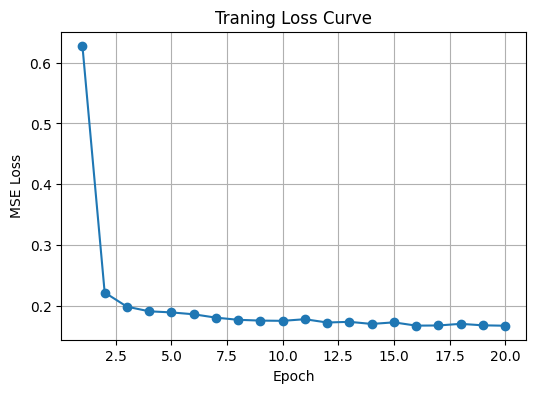
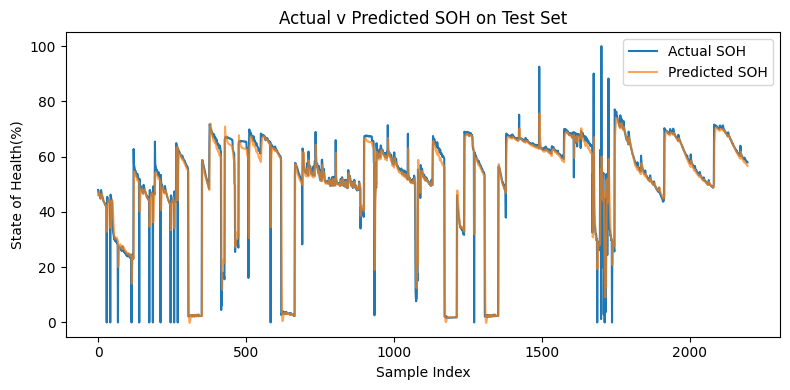

#EV Battery Health Forecasting

**Overview:** Predict the battery State of Health from telematics and weather.

## Structure 
- `data/raw/` - original CSVs
- `data/processed/` - cleaned data
- `notebooks/` - Jupyter analyses
- `src/` - data prep and modeling modules
- `models/` - saved PyTorch models
- `reports/` - charts and write-ups

## Step 1: Setup
```bash 
git clone https://github.com/mbarrientos1129/ev_battery_health_forecast
cd ev_battery_health_forecast
pip install -r requirements.txt
```
## Step 2: Data Ingestion & Cleaning
We take our raw EV metrics file (`data/raw/ev_metrics.csv`) and turn it into an analysis-ready table:

1. **Load the CSV**  
   ```python
   df = pd.read_csv('data/raw/ev_metrics.csv')
   ```
2. **Coerce numeric fields**
    ```python
    df['Capacity'] = pd.to_numeric(df['Capacity'], errors='coerce')
    df['ambient_temperature'] = pd.to_numeric(df['ambient_temperature'], errors='coerce')
    ```
3. **Drop invalid rows**
    ```python
    df = df.dropna(subset=['Capacity'])
    ```
4. **Compute State-of-Health (SoH)**
    ```python
    max_cap = df['Capacity'].max()
    df['SOH'] = df['Capacity'] / max_cap * 100
    ```
5. **Parse timestamps**
    ```python
    def parse_start_time(s): …
    df['timestamp'] = df['start_time'].apply(parse_start_time)
    ```
6. **Filter to discharge cycles**
    ```python
    df = df[df['type']=='discharge']
    ```
7. **Result**
    ```
    We end up with a DataFrame containing:['timestamp','Capacity','SOH','ambient_temperature','battery_id','test_id'].
    ```
## Step 3: Exploratory Data Analysis & Feature Engineering

In this phase, we dive into the cleaned data to understand its structure and craft new predictors for our model.

1. **Quick Data Summary**  
   - Checked the DataFrame shape and dtypes: 'df.shape', 'df.dtypes'  
   - Computed descriptive statistics on 'Capacity', 'SOH', and 'ambient_temperature':  
     ```python
     df[['Capacity','SOH','ambient_temperature']].describe().transpose()
     ```

2. **Visualizations**  
   - **Time-series plot** of 'SOH' over 'timestamp' to reveal degradation trends.  
   - **Histogram** of 'SOH' distribution across all discharge cycles.  
   - **Scatter** of 'SOH' vs. 'ambient_temperature' to assess temperature impact.

3. **Correlation Analysis**  
   - Calculated Pearson correlations among 'Capacity', 'SOH', and 'ambient_temperature'.  
   - Plotted a heatmap to identify which features are most predictive.

4. **Feature Engineering**  
   - **soh_diff**: SOH between consecutive cycles ('df['SOH'].diff()')  
   - **soh_roll_mean**: rolling mean of 'soh_diff' over 10 cycles  
   - **cycle_idx**: simple sequential index for each discharge event  
   - **temp_bin**: bucketized ambient temperatures (e.g. 'pd.cut()' into ranges)

You can see the full code and outputs in the [01-exploration.ipynb](notebooks/01-exploration.ipynb) notebook.

## Step 4: Modeling & Evaluation with PyTorch

We’ll turn our engineered features into sequences, train an LSTM model to forecast SOH, and evaluate its performance.

1. **DataLoader Prep**  
   - Convert 'df' into sliding windows of length 'seq_len' (e.g. 24).  
   - Split into train/test (80/20).  
   - Wrap in 'TensorDataset' & 'DataLoader' for batching.

2. **Model Definition**  
   - In 'src/modeling.py', define 'SoHForecaster(nn.Module)' with an LSTM and a final 'Linear' layer.  
   - Add a 'train_model()' utility that runs epochs and returns the trained model.

3. **Training & Loss Curve**  
   - Instantiate the model in your notebook.  
   - Train for N epochs, record average MSE loss per epoch.  
   - Plot training loss vs. epoch to check convergence.

   

4. **Test Evaluation**  
   - Predict on the test set.  
   - Plot actual vs. predicted SOH.  
   - Compute MAE or RMSE for a numeric performance metric.

5. **Save the Model**  
   - Serialize the trained weights to 'models/soh_forecaster.pt' using 'torch.save()'.

   

Full code examples live in 'src/modeling.py' and 'notebooks/02-modeling.ipynb'.
